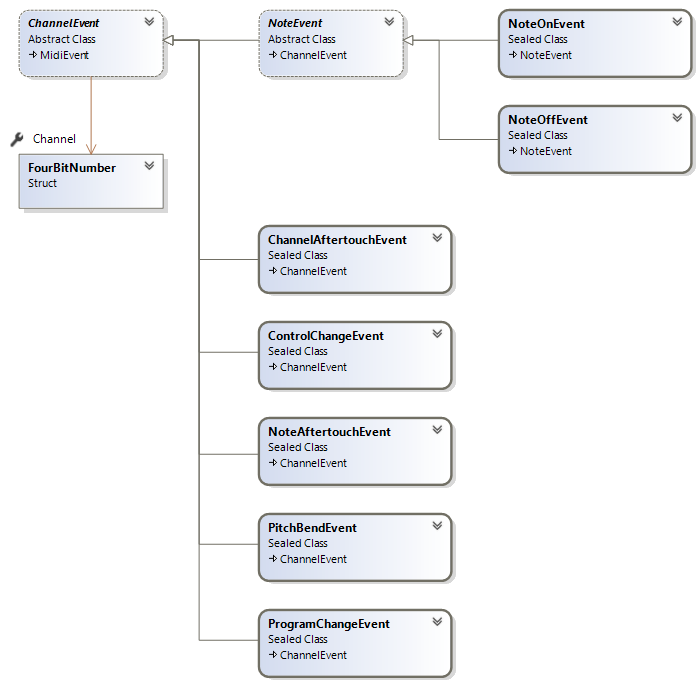

Channel events represent instructions for playing devices of how to generate sound. MIDI file can contain following channel events:

* [Channel Aftertouch](#channel-aftertouch)
* [Control Change](#control-change)
* [Note Aftertouch](#note-aftertouch)
* [Note On](#note-on)
* [Note Off](#note-off)
* [Pitch Bend](#pitch-bend)
* [Program Change](#program-change)

The class diagram below shows channel event types in the DryWetMIDI:



`ChannelEvent` is the base class which represents channel event.

```csharp
public abstract class ChannelEvent : MidiEvent
{
    // ...
    public FourBitNumber Channel { get; set; }
    // ...
}
```

This class has the `Channel` property of the `FourBitNumber` type. `FourBitNumber` is the structure that represents integer number from 0 to 15. Many of the channel event classes use also `SevenBitNumber` data type which is the structure that represents integer number from 0 to 127.

`FourBitNumber` and `SevenBitNumber` are data types that represent valid ranges for some properties of MIDI events. DryWetMIDI uses value validation on data type level via casting user values to specific types rather than checking on out-of-range in all the event classes property setters. These types have explicit operators to cast standard .NET integer numbers to them and implicit operators to cast to [`byte`](https://msdn.microsoft.com/library/system.byte(v=vs.110).aspx).

`NoteEvent` is the base class for Note On and Note Off events:

```csharp
public sealed class NoteEvent : ChannelEvent
{
    // ...
    public SevenBitNumber NoteNumber { get; set; }
    public SevenBitNumber Velocity { get; set; }
    // ...
}
```

Let's see on all channel event classes presented in the DryWetMIDI.

### Channel Aftertouch

```csharp
public sealed class ChannelAftertouchEvent : ChannelEvent
{
    // ...
    public ChannelAftertouchEvent() { /*...*/ }
    public ChannelAftertouchEvent(SevenBitNumber aftertouchValue) { /*...*/ }
    // ...
    public SevenBitNumber AftertouchValue { get; set; }
    // ...
}
```

### Control Change

```csharp
public sealed class ControlChangeEvent : ChannelEvent
{
    // ...
    public ControlChangeEvent() { /*...*/ }
    public ControlChangeEvent(SevenBitNumber controlNumber, SevenBitNumber controlValue) { /*...*/ }
    // ...
    public SevenBitNumber ControlNumber { get; set; }
    public SevenBitNumber ControlValue { get; set; }
    // ...
}
```

### Note Aftertouch

```csharp
public sealed class NoteAftertouchEvent : ChannelEvent
{
    // ...
    public NoteAftertouchEvent() { /*...*/ }
    public NoteAftertouchEvent(SevenBitNumber noteNumber, SevenBitNumber aftertouchValue) { /*...*/ }
    // ...
    public SevenBitNumber NoteNumber { get; set; }
    public SevenBitNumber AftertouchValue { get; set; }
    // ...
}
```

### Note On

```csharp
public sealed class NoteOnEvent : NoteEvent
{
    // ...
    public NoteOnEvent() { /*...*/ }
    public NoteOnEvent(SevenBitNumber noteNumber, SevenBitNumber velocity) { /*...*/ }
    // ...
}
```

### Note Off

```csharp
public sealed class NoteOffEvent : NoteEvent
{
    // ...
    public NoteOffEvent() { /*...*/ }
    public NoteOffEvent(SevenBitNumber noteNumber, SevenBitNumber velocity) { /*...*/ }
    // ...
}
```

### Pitch Bend

```csharp
public sealed class PitchBendEvent : ChannelEvent
{
    // ...
    public PitchBendEvent() { /*...*/ }
    public PitchBendEvent(ushort pitchValue) { /*...*/ }
    // ...
    public ushort PitchValue { get; set; }
    // ...
}
```

### Program Change

```csharp
public sealed class ProgramChangeEvent : ChannelEvent
{
    // ...
    public ProgramChangeEvent() { /*...*/ }
    public ProgramChangeEvent(SevenBitNumber programNumber) { /*...*/ }
    // ...
    public SevenBitNumber ProgramNumber { get; set; }
    // ...
}
```