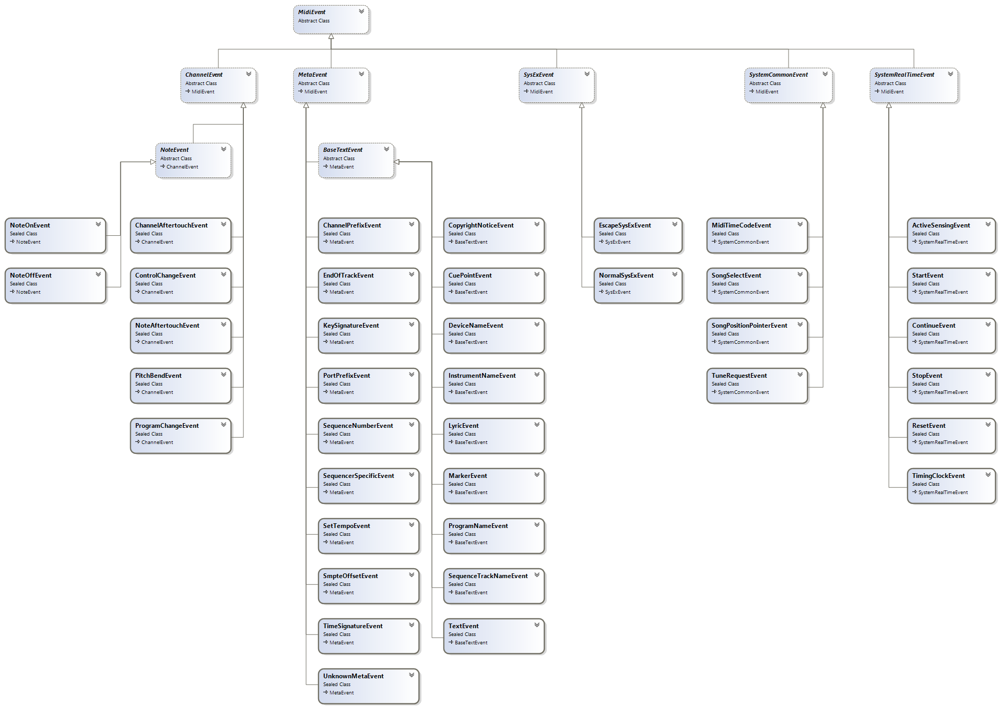

MIDI data is stored in a MIDI file as *events*. Events are placed inside track chunks and can be of three types:
* [Channel (voice) events](Channel-events.md)  
  _MIDI voice messages are those messages that are specific to a MIDI channel and directly affect the sound produced by MIDI devices._
* [Meta events](Meta-events.md)  
  _MIDI meta messages are messages that contains information about the MIDI sequence and that are not to be sent over MIDI ports._
* [System exclusive events](Sysex-events.md)  
  _A MIDI event that carries the MIDI system exclusive message, also known as a "MIDI sysex message", carries information that is specific to the manufacturer of the MIDI device receiving the message. The action that this message prompts for can be anything._
* [System common events](System-common-events.md)  
  _MIDI system common messages are those MIDI messages that prompt all devices on the MIDI system to respond (are not specific to a MIDI channel), but do not require an immediate response from the receiving MIDI devices._
* [System real-time events](System-real-time-events.md)  
  _MIDI system realtime messages are messages that are not specific to a MIDI channel but prompt all devices on the MIDI system to respond and to do so in real time._

Image below shows the class diagram of event types in the DryWetMIDI:



`MidiEvent` is the base class which represents a MIDI event. It has one public property `DeltaTime` and one public method `Clone`. Delta-time is the offset from the previous event. If the first event in a track chunk occurs at the very beginning of a track, or if two events occur simultaneously, a delta-time of zero is used. Delta-time is in some fraction of a beat (or a second, for recording a track with SMPTE times), as specified by the time division of a MIDI file (or tempo map used in playback/recording).

```csharp
public abstract class MidiEvent
{
    // ...
    public long DeltaTime { get; set; }
    public MidiEventType EventType { get; }
    // ...
    public MidiEvent Clone() { /*...*/ }
    // ...
}
```

---

_Descriptions of MIDI events are taken from [RecordingBlogs.com](https://www.recordingblogs.com)._