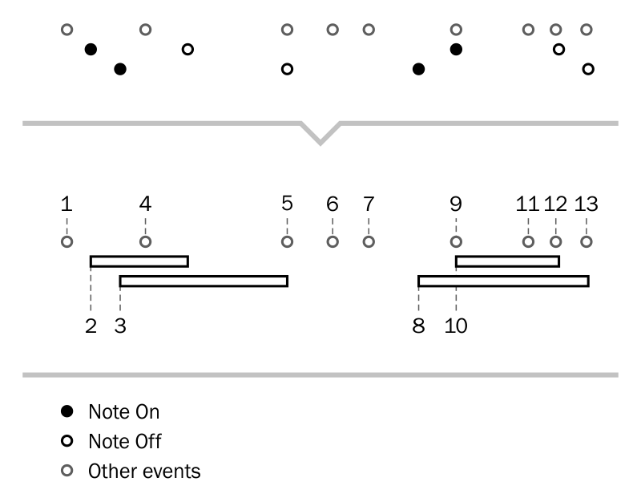
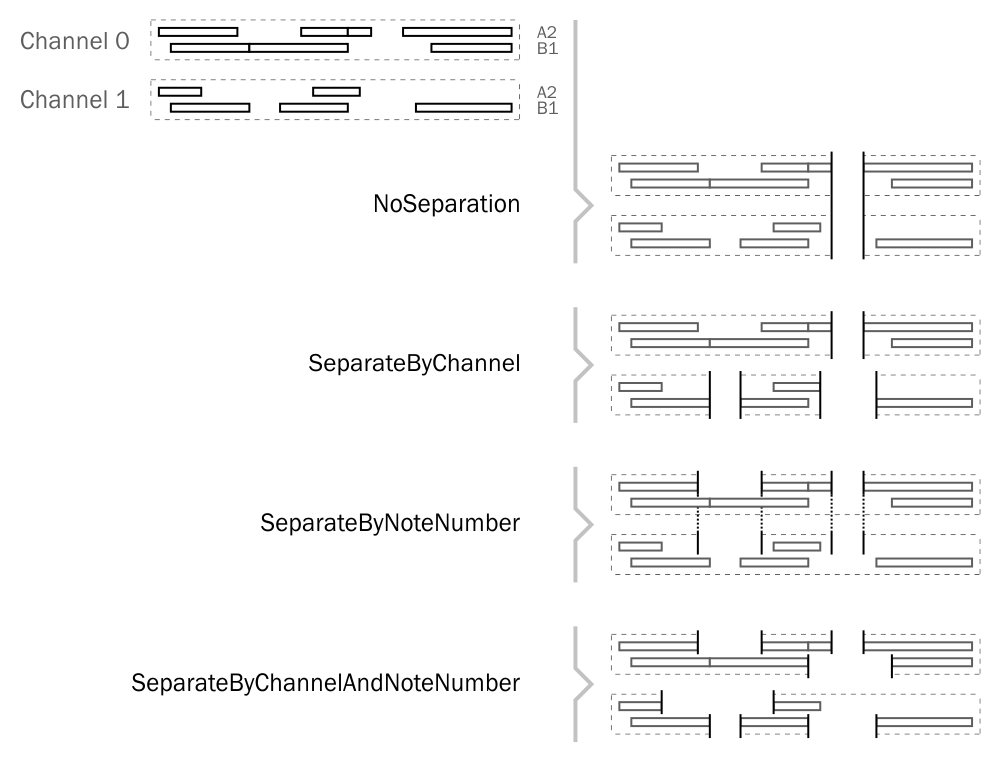

To effectively manage note events DryWetMIDI provides the `NotesManager` class to help with this. Instead of messing with Note On/Off events this manager allows to operate by `Note` objects.

```csharp
using (var notesManager = new NotesManager(trackChunk.Events))
{
    NotesCollection notes = notesManager.Notes;

    var cSharpNotes = notes.Where(n => n.NoteName == NoteName.CSharp);
    notes.Add(new Note(NoteName.A, 4)
              {
                  Time = 123,
                  Length = 456,
                  Velocity = (SevenBitNumber)45
              });
}
```

`Note` has following properties:

* `Time`
* `Length`
* `NoteNumber`
* `Velocity`
* `OffVelocity`
* `Channel`
* `NoteName`
* `Octave`

Please read [general information about events managers](Events-managers.md) prior to use `NotesManager`.

To get collection of all notes being managed by the current `NotesManager` you need to use `Notes` property which returns `NotesCollection`. `NotesCollection` has methods for adding and removing notes and also can be enumerated since it implements `IEnumerable<Note>`. In addition to these methods there are extension ones contained in `TimedObjectUtilities` and `LenghthedObjectUtilities`. For example, you can get all notes in the first track chunk of a MIDI file that end at 20 seconds from the start of the file and get length of the first found note in hours:minutes:seconds format:

```csharp
TempoMap tempoMap = midiFile.GetTempoMap();

using (var notesManager = midiFile.GetTrackChunks().First().ManageNotes())
{
    var notesEndedAt20Seconds = notesManager.Notes
                                            .EndAtTime(new MetricTimeSpan(0, 0, 20),
                                                       tempoMap);

    var firstNoteLength = notesEndedAt20Seconds.First()
                                               .LengthAs<MetricTimeSpan>(tempoMap);
}
```

Read the [Time and length](Time-and-length.md) page to learn more about custom time and length.

As you can see there is another way to get an instance of the `NotesManager` – through the `ManageNotes` extension method. This method and another useful ones are placed in `NotesManagingUtilities`. For example, to get all notes contained in a MIDI file you can write:

```csharp
IEnumerable<Note> notes = midiFile.GetNotes();
```

### Special utilities

There are several special utility methods that can be useful in real work with notes.

#### `GetTimedEventsAndNotes`

```csharp
IEnumerable<ITimedObject> GetTimedEventsAndNotes(this IEnumerable<TimedEvent> timedEvents)
```

The `GetTimedEventsAndNotes` is an extension method for `IEnumerable<TimedEvent>` placed in `GetTimedEventsAndNotesUtilities` class. This method iterates through the collection of `TimedEvent` returning `Note` for Note On / Note Off event pairs and original `TimedEvent` for all other events. The image below illustrates work of this method:



#### `GetNotesAndRests`

```csharp
IEnumerable<ILengthedObject> GetNotesAndRests(this IEnumerable<Note> notes,
                                              RestSeparationPolicy restSeparationPolicy)
```

The `GetNotesAndRests` is an extension method for `IEnumerable<Note>` placed in `GetNotesAndRestsUtilities` class. This method iterates through the specified collection of `Note` returning instances of `Note` and `Rest` where rests calculated using the specified policy. The policy is specified via `restSeparationPolicy` parameter of `RestSeparationPolicy` type which has the following values:

Value | Description
----- | -----------
`NoSeparation` | Rests should be constructed only when there are no notes at all on any channel.
`SeparateByChannel` | Rests should be constructed individually for each channel ignoring note number.
`SeparateByNoteNumber` | Rests should be constructed individually for each note number ignoring channel.
`SeparateByChannelAndNoteNumber` | Rests should be constructed individually for each channel and note number.

The image below illustrates how this policy affects rests building:



#### `ResizeNotes`

```csharp
void ResizeNotes(this IEnumerable<Note> notes,
                 ITimeSpan length,
                 TimeSpanType distanceCalculationType,
                 TempoMap tempoMap)
void ResizeNotes(this IEnumerable<Note> notes,
                 double ratio,
                 TimeSpanType distanceCalculationType,
                 TempoMap tempoMap)
```

Resizes group of notes to the specified length or by the specified ratio treating all notes as single object. `distanceCalculationType` defines the type (and therefore units) of distances calculations.

The following image shows the process in action:

