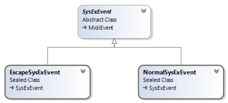

System exclusive (sysex) event is used to specify a MIDI system exclusive message, either as one unit or in packets, or as an "escape" to specify any arbitrary bytes to be transmitted. MIDI file can contain following sysex events:

* [Normal](#normal)
* [Escape](#escape)

The class diagram below shows system exclusive event types in the DryWetMIDI:



`SysExEvent` is the base class which represents system exclusive event.

```csharp
public abstract class SysExEvent : MidiEvent
{
    // ...
    public bool Completed { get; }
    public byte[] Data { get; set; }
    // ...
}
```

This class has the `Data` property that holds an event's data and the `Completed` property which indicates whether or not an event is completed. Completed sysex event has the last byte of its data set to 0xF7. Some synthesizer manufacturers specify that their system exclusive messages are to be transmitted as little packets. Each packet is only part of an entire syntactical sysex message and such packets will have `Completed` set to false.

Sysex event can start with 0xF0 for normal sysex event and with 0xF7 for "escape" sysex event.

### Normal

```csharp
public sealed class NormalSysExEvent : SysExEvent
{
    // ...
    public NormalSysExEvent() { /*...*/ }
    public NormalSysExEvent(byte[] data) { /*...*/ }
    // ...
}
```

### Escape

```csharp
public sealed class EscapeSysExEvent : SysExEvent
{
    // ...
    public EscapeSysExEvent() { /*...*/ }
    public EscapeSysExEvent(byte[] data) { /*...*/ }
    // ...
}
```
